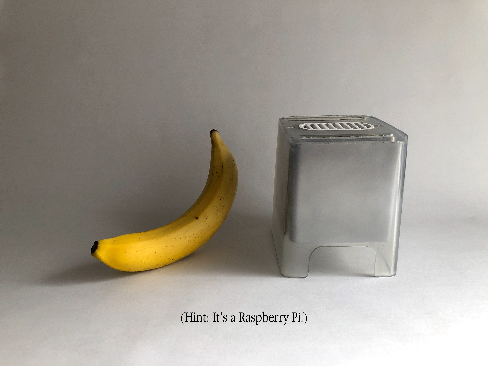
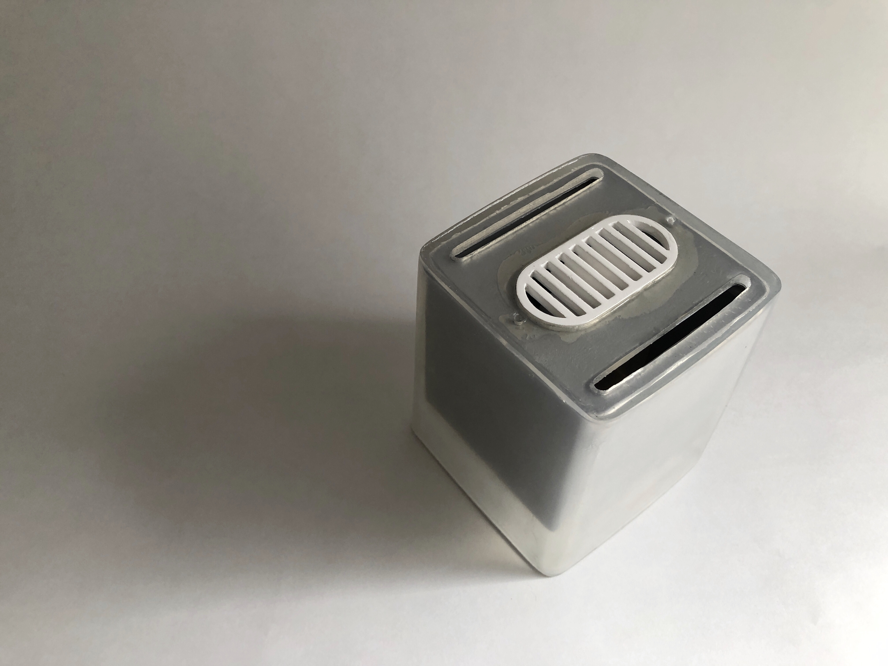
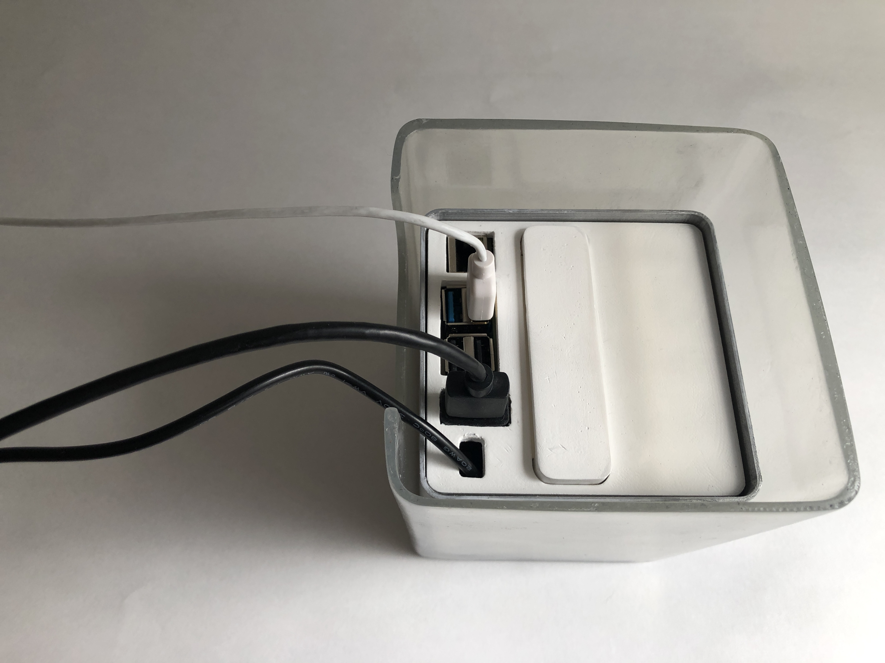
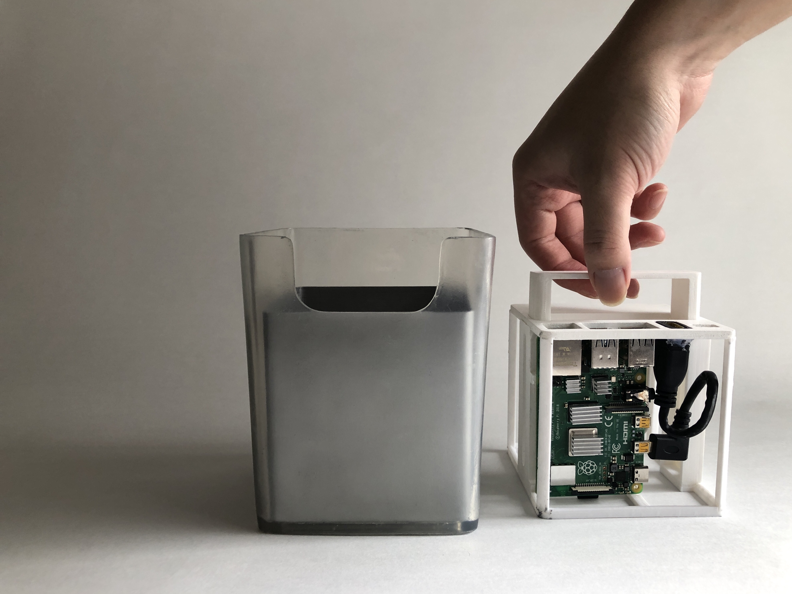
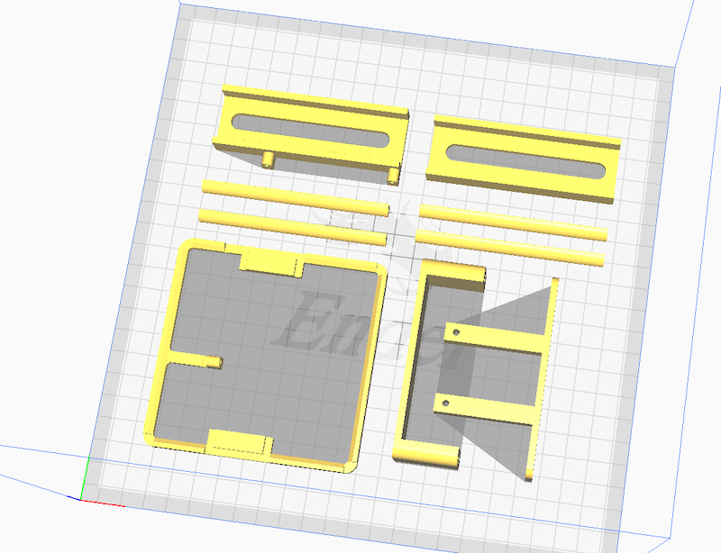

## Mini P4 Cube - a Raspberry Pi 4 computer in a 4" Cube 

|    |    |    |
|-----------|----------------|----------------|

See how it works [on YouTube](https://www.youtube.com/watch?v=KmeAdLOaYtU), and find the build log [on Medium](https://medium.com/@penk/miniature-g4-cube-d86a357a9614)

### Off-the-shelf parts 

- Push to open latch ([https://www.amazon.co.jp/dp/B07LGNM7FB](https://www.amazon.co.jp/dp/B07LGNM7FB))
- micro HDMI to HDMI cable

Optional items: 

- TTP233 touch switch
- USB type-C female to male cable with a switch ([https://www.amazon.co.jp/dp/B085T7MY68](https://www.amazon.co.jp/dp/B085T7MY68))

### 3D Printing parts 

All parts can be printed without support material, except the IO panel. 
Printing orentation: 

## Copyright & License 

Copyright (c) 2020 Ping-Hsun "penk" Chen. All rights reserved.

All files and documentations are available under a Creative Commons BY-SA 4.0 international license. 
